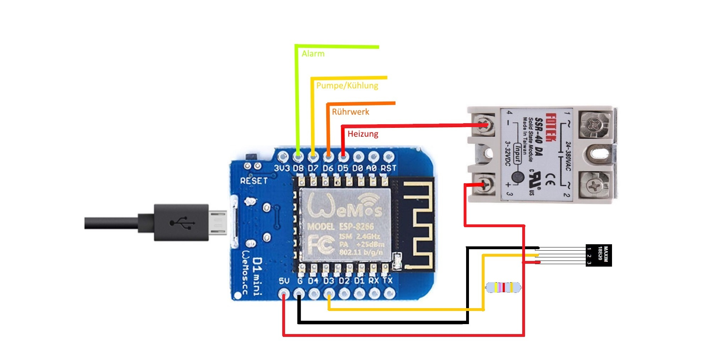

# IMiniBrauerei
WIFI Komplettsteuerung für Brauerei 

## Danksagung:
Ein Danke möchte ich glassart sagen, der mich immer kräftig beim Testen unterstützt.

## Bauteileliste:

- WEMOS D1 Mini
- DS18B20 Temperatursensor
- Widerstand 4,7 KOhm
- bis zu 4 SSR zum Schalten der Funktionen 
- ggf. USB-Kabel und USB-Steckernetzteil ( hat wohl jeder heute was rum zu liegen )

Sieht kompliziert aus, ist es aber gar nicht ....

IMiniBrauerei gem. Schaltplan.jpg verdrahten

## Installation:

- IMiniBrauerei am USB-Port anschließen
- ESP8266Flasher.exe öffnen
- Auf Config Reiter wechseln
- IMiniBrauerei.bin öffnen ( Erstes Zahnrädchen )
- Auf Operation Reiter wechseln
- COM-Port des WEMOS auswählen
- Flashen

### Die IMiniBrauerei ist fertig !

## Bedienung:

- Zwei mal Reset am WEMOS drücken, dazwischen ein zwei Sekunden Pause lassen.
- WEMOS spannt ein eigenes WLAN-Netzwerk auf, die LED am WEMOS leuchtet durchgehend.
- Mit geeignetem Gerät mit dem WLAN des WEMOS verbinden ( z.B. Handy, Tablet, Laptop.... )
- Browser an dem verbunden Gerät öffnen.
- Wenn die Config-Seite nicht automatisch öffnet im Browser die Adresse 192.168.4.1 eingeben
- Auf Config clicken und die WLAN-Daten und die Ports einstellen - anschliessend "SAVE" drücken
- Der WEMOS prüft jetzt, ob die Eingaben stimmen, verbindet sich mit dem angegebenen WLAN-Netzwerk.

## Verhalten:

Der WEMOS sendet jetzt im 5 Sekundentakt UDP-Nachrichten mit der Temperatur auf dem eingegeben Port durchs Netzwerk.
Er Empfängt im Schaltbefehle von der Brauerei, schaltet die Zugehörigen SSRs und stellt den Status als WEBServer unter seiner IP-Adresse zur Verfügung.

## Bedienung in der Brauerei:

- In der Brauerei Temperaturmessung "Arduino" wählen.
- Damit die SSRs schalten auf dem Einstellungs Reiter unter Arduino Relais, die Relais auswählen
- Auf dem Arduino Reiter "LAN/WLAN", die "IP-Adresse" des WEMOS und den passenden "Port-IN" und "Port-OUT" wählen
- "Sensortyp" spielen für das iThermometer keine Rolle. 

## Abschluss:

Fertig, die Brauerei sollte jetzt die Temperatur anzeigen und die SSRs sollten von der Brauerei schaltbar sein
Diese Prozedur ist nur einmal nötig. Die Einstellungen bleiben in der Brauerei und im WEMOS erhalten.
Will man die Einstellungen ändern, 2x mit kurzem Abstand Reset am WEMOS drücken.
Die USB-Verbindung ist ebenfalls nicht mehr nötig. Der WEMOS kann mit einem beliebigen Handy-USB-Ladegerät 
mit Spannung versorgt werden.
Die Datenübertragung erfolgt kabellos per WLAN.

## Zusatzoptionen:
- Wer etwas mehr löten mag kann auf den WEMOS noch ein OLED aufstecken. Das würdee ich sehr empfehlen. Man bekommt damit die Soll, Ist-Temperatur, Netzwerkstatus der Brauerei, der Schaltzustand der SSRs und vieles mehr direkt angezeigt. 
  [>Link<](http://www.ebay.de/itm/WeMos-D1-mini-WiFi-OLED-0-66-I2C-TFT-Modul-ESP8266-NodeMcu-LUA-/291999752242?hash=item43fc8aa032:g:cRAAAOSwjDZYeWj1 "Link zum OLED-Anbieter bei Ebay")  
  
  
